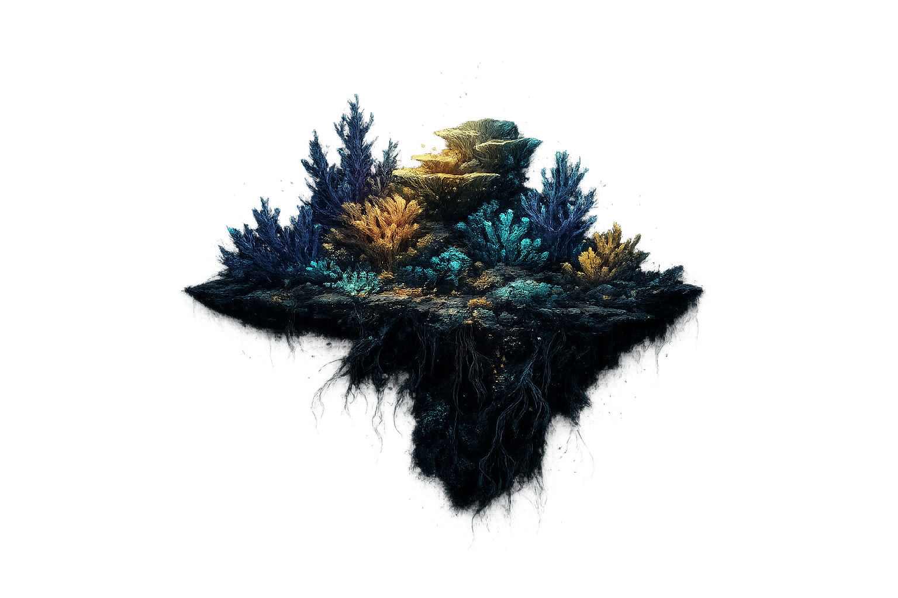

<div align="center">
  
  <h1>🌊 CoralLens AI</h1>
  <p><em>Sistem Estimasi Kondisi Kesehatan Terumbu Karang Berbasis Deep Learning</em></p>
  
  [](https://www.python.org/)
  [](https://fastapi.tiangolo.com/)
  [](https://reactjs.org/)
  [](https://pytorch.org/)
</div>

---

## 📖 Tentang Proyek
**CoralLens** adalah aplikasi berbasis web yang mengintegrasikan teknologi *Computer Vision* dan *Deep Learning* untuk melakukan segmentasi semantik pada citra bawah laut. Aplikasi ini dikembangkan untuk mendeteksi, menyoroti, dan mengukur persentase kerusakan (pemutihan/penyakit) pada terumbu karang guna memfasilitasi pemantauan ekosistem laut oleh peneliti, NGO, dan institusi pemerintahan.

Proyek ini dibangun sebagai bagian dari Mata Kuliah **Pengolahan Citra Digital (Semester 6)**.

## ✨ Fitur Utama
- **🔬 Segmentasi Presisi Piksel:** Memanfaatkan arsitektur **U-Net** dengan *backbone* **EfficientNet-b3**.
- **🎛️ Dynamic Thresholding:** Memberikan kontrol sensitivitas pendeteksian kerusakan karang (0% - 100%) bagi peneliti.
- **📄 Laporan Otomatis (PDF):** Kemampuan untuk mengekspor hasil analisis visual, metrik prediksi, dan **Rekomendasi Tindakan Otomatis** ke dalam bentuk PDF yang siap cetak.
- **🎨 Visualisasi Before/After:** Slider interaktif halus untuk membandingkan foto mentah dan hasil olahan AI.
- **📚 Ensiklopedia Karang:** Koleksi edukasi interaktif mengenai morfologi karang, dataset, dan berbagai penyakitnya.

## 🧠 Arsitektur Kecerdasan Buatan (AI)
Pipeline *Machine Learning* CoralLens beroperasi dengan langkah berikut:
1. **Preprocessing (Rembg U²-Net):** Melakukan *alpha matting* untuk memisahkan objek terumbu karang dari air/latar belakang *(background removal)* secara otomatis.
2. **Feature Extraction:** Memanfaatkan **EfficientNet-B3** untuk mengenali pola spasial pada citra laut.
3. **Semantic Segmentation:** **U-Net** memprediksi setiap piksel apakah tergolong 'sehat' atau 'rusak/terinfeksi'.
4. **Post-Processing Overlay:** Hasil *masking* diwarnai (Merah = Rusak, Hijau = Sehat) dan ditempel kembali di atas citra asli menggunakan transparansi alfa.

### 📊 Performa Model Evaluasi
- **Global Accuracy:** `91.55%`
- **F1-Score:** `93.02%`
- **Mean IoU:** `86.95%`
- **Loss Function:** `Binary Cross Entropy`

## 🚀 Cara Menjalankan (Local Development)

### 1. Menjalankan Backend (FastAPI + PyTorch)
```bash
# Masuk ke direktori backend
cd backend

# Install dependensi
pip install -r requirements.txt

# Jalankan server
uvicorn main:app --reload --host 0.0.0.0 --port 8000
```
*Pastikan model `best_unet_efficientnet.pth` berada di direktori `backend/model/weights/`.*

### 2. Menjalankan Frontend (React + Vite)
```bash
# Buka terminal baru dan masuk ke direktori frontend
cd frontend

# Install dependensi Node.js
npm install

# Jalankan development server
npm run dev
```
*Aplikasi web dapat diakses pada `http://localhost:5173`.*

## 📂 Struktur Repositori
```text
CoralLens/
├── backend/                  # Python FastAPI Backend
│   ├── api/                  # Routing REST API (inference)
│   ├── model/                # Arsitektur U-Net & file beban (.pth)
│   └── utils/                # Logika Preprocessing & Alpha Matting
├── frontend/                 # React.js Frontend
│   ├── public/               # Asset statis, video, gambar karang
│   └── src/
│       ├── components/       # UI Components (LandingPage, Dashboard, dll)
│       └── index.css         # Styling & Tailwind setup
└── project_documentation.md  # Dokumen Riset Ekstensif
```

## ⚠️ Known Limitations
- Algoritma *background removal* dapat tidak stabil apabila latar belakang sangat *cluttered* (terdapat banyak objek menumpuk seperti ikan, pasir, karang lain).
- Model rentan terhadap pergeseran spektrum (*Out of Distribution*) seperti foto dari akuarium dengan pencahayaan buatan *Actinic Blue*.

---
<div align="center">
  <b>Dikembangkan dengan 🪸 oleh Mahasiswa Semester 6 - Pengolahan Citra Digital</b>
</div>
