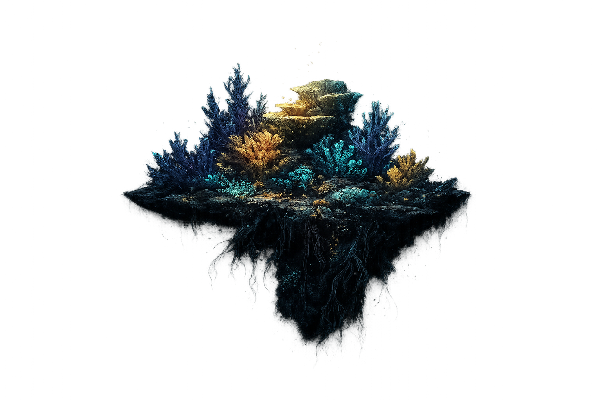

<div align="center">
  
  <h1>🌊 CoralLens AI</h1>
  <p><em>Sistem Estimasi Kondisi Kesehatan Terumbu Karang Berbasis Deep Learning</em></p>
  
  [](https://www.python.org/)
  [](https://fastapi.tiangolo.com/)
  [](https://reactjs.org/)
  [](https://pytorch.org/)
  [](https://vitejs.dev/)
  [](https://tailwindcss.com/)
  [](https://www.docker.com/)
  [](https://huggingface.co/)
  [](https://vercel.com/)
</div>

---

## 📖 Tentang Proyek
**CoralLens** adalah aplikasi berbasis web yang mengintegrasikan teknologi *Computer Vision* dan *Deep Learning* untuk melakukan segmentasi semantik pada citra bawah laut. Aplikasi ini dikembangkan untuk mendeteksi, menyoroti, dan mengukur persentase kerusakan (pemutihan/penyakit) pada terumbu karang guna memfasilitasi pemantauan ekosistem laut oleh peneliti, NGO, dan institusi pemerintahan.

Proyek ini dibangun sebagai bagian dari Mata Kuliah **Pengolahan Citra Digital (Semester 6)**.

## ✨ Fitur Utama
- **🔬 Segmentasi Presisi Piksel:** Memanfaatkan arsitektur **U-Net** dengan *backbone* **EfficientNet-b3**.
- **🎛️ Dynamic Thresholding:** Memberikan kontrol sensitivitas pendeteksian kerusakan karang (0% - 100%) bagi peneliti.
- **📄 Laporan Otomatis (PDF):** Kemampuan untuk mengekspor hasil analisis visual, metrik prediksi, dan **Rekomendasi Tindakan Otomatis** ke dalam bentuk PDF yang siap cetak.
- **🎨 Visualisasi Before/After:** Slider interaktif halus untuk membandingkan foto mentah dan hasil olahan AI.
- **📚 Ensiklopedia Karang:** Koleksi edukasi interaktif mengenai morfologi karang, dataset, dan berbagai penyakitnya.

---

## 🛠️ Teknologi yang Digunakan

### 🎨 Frontend (Client-Side)

| Teknologi | Versi | Fungsi |
|-----------|-------|--------|
| **React.js** | 18.2+ | Library utama untuk membangun antarmuka pengguna (*Single Page Application*) berbasis komponen |
| **Vite** | 8.0 | Build tool dan dev server modern dengan *Hot Module Replacement* (HMR) untuk pengembangan cepat |
| **TailwindCSS** | 4.0 | Utility-first CSS framework untuk styling responsif dan konsisten |
| **GSAP** (GreenSock) | 3.x | Library animasi profesional untuk *scroll-triggered animations*, *parallax*, dan *entrance effects* |
| **Lenis** | latest | Smooth scrolling library untuk pengalaman scroll yang halus dan premium |
| **Recharts** | 2.x | Library visualisasi data React untuk menampilkan grafik radar, bar chart, dan pie chart hasil analisis |
| **jsPDF** | latest | Library client-side untuk menghasilkan laporan PDF secara otomatis tanpa memerlukan server |
| **html2canvas** | latest | Mengkonversi elemen HTML/DOM menjadi gambar canvas untuk disisipkan ke dalam laporan PDF |
| **Lucide React** | latest | Icon library modern berbasis SVG untuk elemen UI |

**Fitur Frontend Utama:**
- 📱 **Fully Responsive Design** — Tampilan optimal di desktop, tablet, dan mobile
- 🌊 **Parallax Scrolling** — Efek kedalaman visual menggunakan GSAP ScrollTrigger
- 🃏 **Interactive Card Stack** — Kartu penyakit karang yang dapat digeser dengan navigasi sentuh (mobile) dan hover (desktop)
- 🖼️ **WebP Image Optimization** — Seluruh aset gambar dikonversi ke format WebP untuk loading 90% lebih cepat
- ⏳ **Lazy Loading** — Gambar hanya dimuat saat terlihat di viewport untuk menghemat bandwidth
- 🎭 **Before/After Slider** — Komponen interaktif untuk membandingkan citra asli dan hasil segmentasi AI
- 📊 **Real-time Dashboard** — Visualisasi hasil deteksi dengan grafik statistik dan riwayat analisis

### ⚙️ Backend (Server-Side)

| Teknologi | Versi | Fungsi |
|-----------|-------|--------|
| **Python** | 3.10+ | Bahasa pemrograman utama untuk seluruh logic backend dan inferensi model AI |
| **FastAPI** | 0.100+ | Framework web API asinkron berkinerja tinggi dengan dokumentasi Swagger otomatis |
| **Uvicorn** | 0.23+ | ASGI server untuk menjalankan aplikasi FastAPI dengan dukungan *async/await* |
| **PyTorch** | 2.0+ | Framework deep learning utama untuk memuat dan menjalankan model U-Net |
| **Segmentation Models PyTorch (SMP)** | 0.3.3+ | Library arsitektur segmentasi yang menyediakan U-Net dengan berbagai backbone encoder |
| **OpenCV (cv2)** | 4.8+ | Library computer vision untuk preprocessing citra (resize, normalisasi, konversi warna) |
| **Pillow (PIL)** | 10.0+ | Library pengolahan gambar Python untuk membaca, memanipulasi, dan menyimpan citra |
| **Albumentations** | 1.3+ | Library augmentasi data citra untuk pipeline transformasi yang konsisten antara training dan inferensi |
| **Rembg** | 2.0+ | Library background removal berbasis **U²-Net** untuk memisahkan objek karang dari latar belakang air |
| **ONNX Runtime** | 1.14+ | Runtime engine untuk menjalankan model U²-Net (Rembg) dengan performa optimal |
| **NumPy** | 1.24+ | Library komputasi numerik untuk manipulasi array dan matriks piksel |
| **Pydantic** | 2.0+ | Library validasi data dan serialisasi untuk memastikan integritas request/response API |
| **python-multipart** | 0.0.6+ | Middleware untuk menangani upload file multipart/form-data dari frontend |

**Arsitektur API:**
```
POST /api/v1/predict
├── Input:  Multipart Form (image file + threshold value)
├── Process:
│   ├── 1. Background Removal (Rembg/U²-Net)
│   ├── 2. Image Preprocessing (Resize 256×256, Normalize, Tensor)
│   ├── 3. Model Inference (U-Net + EfficientNet-B3)
│   ├── 4. Post-Processing (Threshold, Overlay Generation)
│   └── 5. Metric Calculation (Damage %, Condition Label)
└── Output: JSON {overlay_base64, damage_percentage, condition, confidence}
```

### 🚀 Deployment & Infrastructure

| Platform | Fungsi |
|----------|--------|
| **Vercel** | Hosting frontend React/Vite (CDN global, auto-deploy dari GitHub) |
| **HuggingFace Spaces** | Hosting backend FastAPI + PyTorch via Docker container (16GB RAM) |
| **Docker** | Containerisasi backend dengan semua dependensi sistem (OpenCV libs) |
| **GitHub** | Version control dan CI/CD trigger untuk auto-deployment |

---

## 🧠 Arsitektur & Algoritma Kecerdasan Buatan (AI)

### Pipeline Inferensi (Prediction Flow)

```
┌─────────────┐    ┌──────────────┐    ┌────────────────┐    ┌──────────────┐    ┌─────────────┐
│  Input Image │───▶│  Rembg U²-Net │───▶│  Preprocessing  │───▶│  U-Net Model  │───▶│  Output Mask │
│  (JPG/PNG)   │    │  (BG Removal) │    │  (256×256, Norm)│    │  (EfficientNet)│    │  (Overlay)   │
└─────────────┘    └──────────────┘    └────────────────┘    └──────────────┘    └─────────────┘
```

### 1. Background Removal — U²-Net (Rembg)
- **Arsitektur:** U²-Net (*U-square Net*) — nested U-structure dengan RSU blocks (*Residual U-blocks*)
- **Fungsi:** Melakukan *salient object detection* untuk memisahkan objek terumbu karang dari latar belakang air laut, pasir, dan objek non-karang
- **Teknik:** Alpha matting dengan output masking RGBA
- **Tujuan:** Mengisolasi area karang agar model segmentasi tidak terkontaminasi oleh noise latar belakang

### 2. Preprocessing Pipeline
```python
# Langkah Preprocessing:
1. Resize      → 256 × 256 piksel (standar input U-Net)
2. Normalize   → Pixel values / 255.0 (skala 0.0 - 1.0)
3. ToTensor    → Konversi NumPy array ke PyTorch Tensor
4. Permute     → Channel reorder dari HWC → CHW (Height×Width×Channel → Channel×Height×Width)
5. Unsqueeze   → Tambah dimensi batch (1, C, H, W) untuk input model
```

### 3. Semantic Segmentation — U-Net + EfficientNet-B3
- **Arsitektur Utama:** U-Net (*Encoder-Decoder with Skip Connections*)
- **Backbone Encoder:** EfficientNet-B3 (pre-trained pada ImageNet)
  - Menggunakan *Compound Scaling* (resolusi, kedalaman, dan lebar jaringan)
  - 18.4M parameter dengan efisiensi komputasi tinggi
- **Decoder:** U-Net decoder dengan *transposed convolutions* dan *skip connections*
  - Skip connections menggabungkan fitur low-level (tekstur, edge) dari encoder dengan fitur high-level (semantik) dari decoder
- **Output:** Binary segmentation mask (1 channel) — setiap piksel diprediksi sebagai `0` (sehat) atau `1` (rusak)
- **Aktivasi Akhir:** Sigmoid → menghasilkan probabilitas (0.0 - 1.0) per piksel
- **Thresholding:** User-adjustable threshold (default 0.5) untuk mengkonversi probabilitas menjadi keputusan biner

### 4. Post-Processing & Visualisasi
```python
# Langkah Post-Processing:
1. Threshold   → Probabilitas > threshold → piksel "rusak" (merah)
2. Overlay     → Masking berwarna ditempel di atas citra asli
                 - Merah (255, 0, 0)  = Area Rusak/Terinfeksi
                 - Hijau (0, 255, 0)  = Area Sehat
3. Alpha Blend → Transparansi 50% agar detail asli tetap terlihat
4. Metrics     → Hitung rasio piksel rusak / total piksel karang × 100%
5. Condition   → Klasifikasi kondisi:
                 - 0-10%   → "Sangat Baik" (Excellent)
                 - 10-25%  → "Baik" (Good)
                 - 25-50%  → "Sedang" (Fair)
                 - 50-75%  → "Buruk" (Poor)
                 - 75-100% → "Kritis" (Critical)
```

### 5. Training Configuration
| Parameter | Nilai |
|-----------|-------|
| **Dataset** | Roboflow (citra bawah laut terumbu karang) |
| **Augmentasi** | HorizontalFlip, VerticalFlip, RandomBrightnessContrast, GaussNoise, ShiftScaleRotate |
| **Loss Function** | Binary Cross Entropy (BCE) |
| **Optimizer** | Adam (lr = 1e-4) |
| **Input Size** | 256 × 256 piksel |
| **Batch Size** | 16 |
| **Epochs** | ~50 dengan Early Stopping |
| **Pre-trained** | ImageNet weights (Transfer Learning) |

### 📊 Performa Model Evaluasi
| Metrik | Nilai | Deskripsi |
|--------|-------|-----------|
| **Global Accuracy** | `91.55%` | Persentase piksel yang diprediksi dengan benar |
| **F1-Score** | `93.02%` | Harmonic mean dari Precision dan Recall |
| **Mean IoU** | `86.95%` | Rata-rata Intersection over Union antara prediksi dan ground truth |
| **Loss (BCE)** | Konvergen | Binary Cross Entropy loss stabil pada epoch akhir |

---

## 🚀 Cara Menjalankan (Local Development)

### 1. Menjalankan Backend (FastAPI + PyTorch)
```bash
# Masuk ke direktori backend
cd backend

# Install dependensi
pip install -r requirements.txt

# Jalankan server
uvicorn main:app --reload --host 0.0.0.0 --port 8000
```
*Pastikan model `best_unet_efficientnet.pth` berada di direktori `backend/model/weights/`.*

### 2. Menjalankan Frontend (React + Vite)
```bash
# Buka terminal baru dan masuk ke direktori frontend
cd frontend

# Install dependensi Node.js
npm install

# Jalankan development server
npm run dev
```
*Aplikasi web dapat diakses pada `http://localhost:5173`.*

## 📂 Struktur Repositori
```text
CoralLens/
├── backend/                  # Python FastAPI Backend
│   ├── api/                  # Routing REST API (endpoint /predict)
│   │   └── predict.py        # Logic inferensi model
│   ├── model/                # Arsitektur U-Net & file beban (.pth)
│   │   ├── unet_model.py     # Definisi arsitektur U-Net + EfficientNet
│   │   └── weights/          # File model terlatih (.pth)
│   ├── utils/                # Logika Preprocessing & Alpha Matting
│   │   └── preprocessing.py  # Pipeline transformasi citra
│   ├── config.py             # Konfigurasi server dan path model
│   ├── main.py               # Entry point FastAPI application
│   ├── Dockerfile            # Container config untuk HuggingFace Spaces
│   └── requirements.txt      # Python dependencies
├── frontend/                 # React.js Frontend (Vite)
│   ├── public/               # Asset statis
│   │   ├── corals/           # Gambar ensiklopedia karang (.webp)
│   │   ├── hero-bg.mp4       # Video latar belakang hero section
│   │   └── hero-bg.png       # Fallback poster image
│   └── src/
│       ├── components/       # UI Components
│       │   ├── LandingPage.jsx   # Halaman utama (Hero, About, Features, dll)
│       │   ├── Dashboard.jsx     # Dashboard analisis AI & hasil deteksi
│       │   └── GalleryPage.jsx   # Ensiklopedia spesies karang interaktif
│       ├── App.jsx           # Router & state management utama
│       └── index.css         # Design system & Tailwind configuration
├── colab_training.ipynb      # Notebook Google Colab untuk training model
├── project_documentation.md  # Dokumen riset dan dokumentasi teknis
└── README.md                 # Dokumentasi ini
```

## ⚠️ Known Limitations
- Algoritma *background removal* dapat tidak stabil apabila latar belakang sangat *cluttered* (terdapat banyak objek menumpuk seperti ikan, pasir, karang lain).
- Model rentan terhadap pergeseran spektrum (*Out of Distribution*) seperti foto dari akuarium dengan pencahayaan buatan *Actinic Blue*.
- Inferensi pada server CPU gratis (HuggingFace Spaces) memerlukan waktu 10-20 detik per gambar. Untuk performa real-time, diperlukan server GPU.

---
<div align="center">
  <b>Dikembangkan dengan 🪸 oleh Mahasiswa Semester 6 - Pengolahan Citra Digital</b>
</div>

